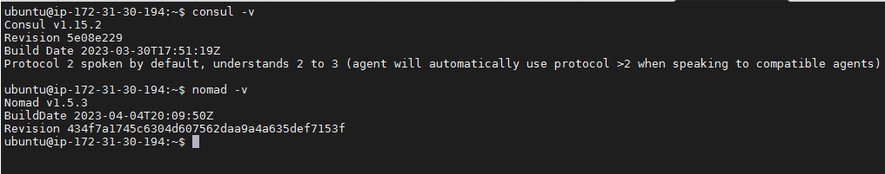
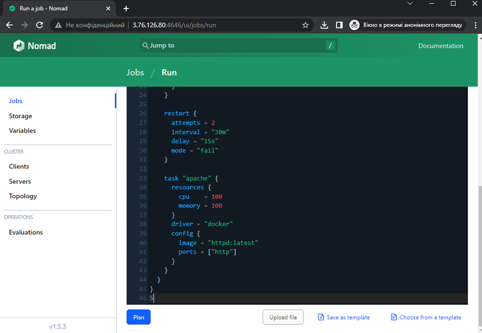

# Running Consul and Nomad on the same node.
In order to install Consul and Nomad, you need to download the binary file from the official repository and place it in one of the directories: local/bin /usr/local/sbin /usr/local/bin /usr/sbin /usr/bin

Download Nomad from https://developer.hashicorp.com/nomad/downloads
For Ubuntu, this can be done like this:

```
curl https://releases.hashicorp.com/nomad/1.5.3/ nomad_1.5.3_linux_amd64.zip --output nomad.zip
sudo apt update
sudo apt install unzip
unzip nomad.zip
sudo mv nomad /usr/sbin/nomad
```

Download Consul

```
curl https://releases.hashicorp.com/consul/1.15.2/consul_1.15.2_linux_amd64.zip --output consul.zip

unzip consul.zip
sudo mv consul /usr/sbin/consul
```

Reinitialize your terminal with command ` source ~/.bashrc ` or close and open it again

Check Consul and Nomad
```
consul -v

nomad -v
```


Install Docker engine
```
sudo apt install -y docker.io
```

Create config file for Nomad
```
mkdir nomad
nano nomad/nomad.conf
```
```
bind_addr = "0.0.0.0"
data_dir = "/tmp/nomad"

advertise {
  http = "127.0.0.1"
  rpc = "127.0.0.1"
  serf = "127.0.0.1"
}

server {
  enabled = true
  bootstrap_expect = 1
}

client {
  enabled = true
  options = {
    "driver.raw_exec.enable" = "1"
  }
}

consul {
  address = "127.0.0.1:8500"
}
```

Launching Consul
```
consul agent -server -client 0.0.0.0 -advertise 127.0.0.1 -data-dir /tmp/consul -ui -bootstrap
```
Launching Nomad
```
sudo nomad agent -dev --config nomad/nomad.conf
```
Checking Concul
http://your-ip:8500/


Checking out Nomad
 http://your-ip :4646/


Nomad and Consul cannot be run in the background, but you can create a service if necessary:
```
sudo nano /etc/systemd/system/consul.service
```
```
[Unit]
Description=Consul Service Discovery Agent
After=network-online.target
Wants=network-online.target
[Service]
Type=simple
User=root
Group=root
ExecStart=/usr/sbin/consul agent -server -client 0.0.0.0 \
            -advertise=127.0.0.1 \
            -data-dir=/tmp/consul \
            -ui -bootstrap
ExecReload=/bin/kill -HUP $MAINPID
KillSignal=SIGINT
TimeoutStopSec=5
Restart=on-failure
SyslogIdentifier=consul
[Install]
WantedBy=multi-user.target
```
```
sudo mkdir /etc/nomad.d
sudo cp nomad/nomad.conf /etc/nomad.d

sudo nano /etc/systemd/system/nomad.service
```
```
[Unit]
Description=Nomad Service Cluster Agent
After=network-online.target
Wants=network-online.target
[Service]
Type=simple
User=root
Group=root
ExecStart=/usr/sbin/nomad agent -dev --config /etc/nomad.d/nomad.conf
ExecReload=/bin/kill -HUP $MAINPID
KillSignal=SIGINT
TimeoutStopSec=5
Restart=on-failure
SyslogIdentifier=nomad
[Install]
WantedBy=multi-user.target
```
```
sudo systemctl daemon-reload

sudo systemctl start consul

sudo systemctl start nomad
```

If Consul and Nomad are running, you can add a job using the Web interface. In my case, it is 3 instances apache web server running in docker.


Or the same using the terminal
```
nano nomad/webserver.nomad
```
```
job "webserver" {
  datacenters = ["dc1"]
  type = "service"

  group "webserver" {
    count = 3
    network {
      port "http" {
        to = 80
      }
    }

    service {
      name = "apache-webserver"
      tags = ["urlprefix-/"]
      port = "http"
      check {
        name = "alive"
        type = "http"
        path = "/"
        interval = "10s"
        timeout = "2s"
      }
    }

    restart {
      attempts = 2
      interval = "30m"
      delay = "15s"
      mode = "fail"
    }

    task "apache" {
      resources {
        cpu = 100
        memory = 100
      }
      driver = "docker"
      config {
        image = "httpd:latest"
        ports = ["http"]
      }
    }
  }
}
```
```
sudo nomad job run -address=http://127.0.0.1:4646/v1/jobs nomad/webserver.nomad

```
let's add load balancer Fabio, it woks on port 9999 and 9998
```
nano nomad/fabio.nomad
```
```
job "fabio" {
  datacenters = ["dc1"]
  type = "system"

  group "fabio" {
    network {
      port "lb" {
        static = 9999
      }
      port "ui" {
        static = 9998
      }
    }
    task "fabio" {
      driver = "docker"
      config {
        image = "fabiolb/fabio:1.6.2"
        network_mode = "host"
        ports = ["lb", "ui"]
      }
      env {
        registry_consul_addr = "127.0.0.1:8500"
       # registry_consul_token = ""add if you have consul enabled cluster""
      }
      resources {
        cpu = 200
        memory = 128
      }
    }
  }
}
```
```
sudo nomad job run -address=http://127.0.0.1:4646/v1/jobs nomad/fabio.nomad
```


In docker we can also see all running containers.


All new services were automatically added to the consul.


